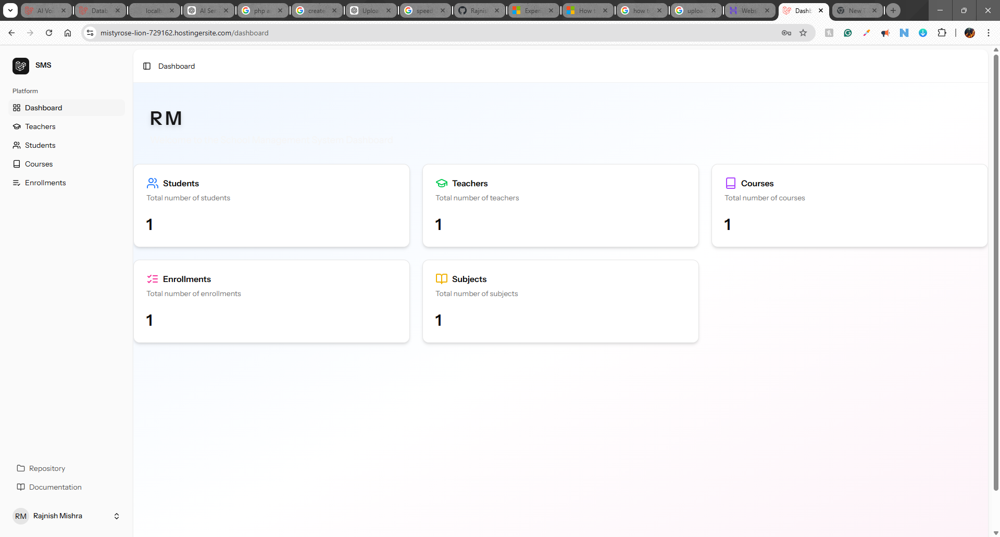
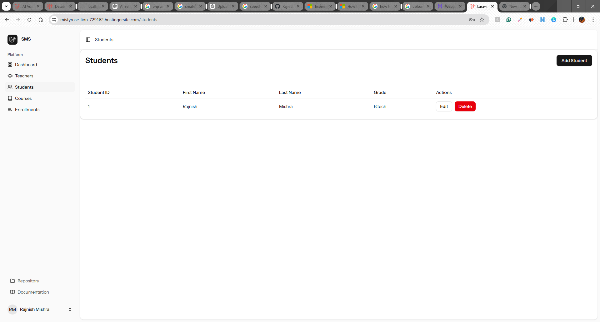
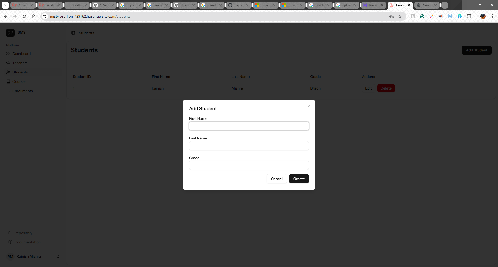
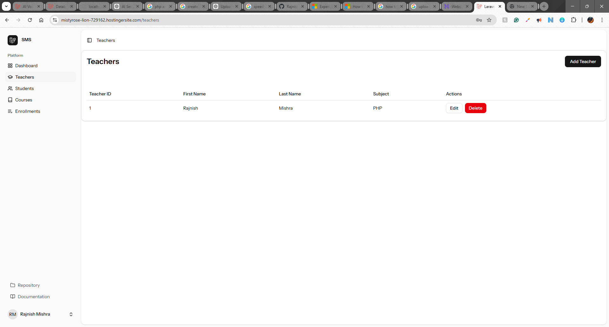
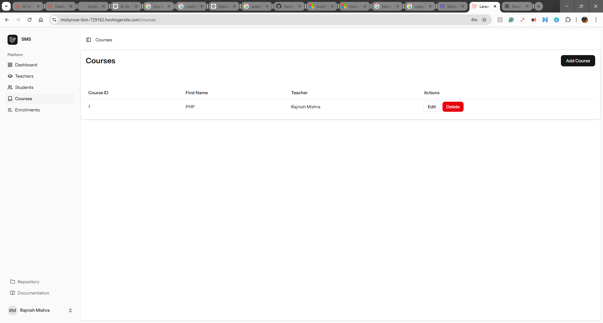
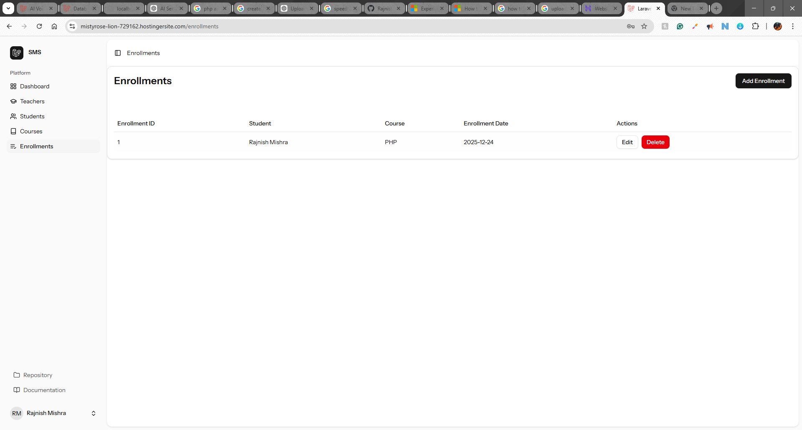

# School Management System (SMS)

A modern full-stack School Management System built using **Laravel 12** and the **Laravel React Starter Kit**. This system allows managing students, teachers, courses, and enrollments with a clean dashboard interface.

---

## Tech Stack

Backend:

* Laravel 12
* PHP 8+
* MySQL

Frontend:

* React (Laravel Starter Kit)
* Inertia.js
* Vite
* Tailwind CSS

---

## Features

* Dashboard with statistics
* Student Management (Add, Edit, Delete)
* Teacher Management
* Course Management
* Enrollment Management
* Modern responsive UI
* RESTful architecture

---

## Screenshots

### Dashboard



### Students



### Add Student



### Teachers



### Courses



### Enrollments



---

## Installation

Clone repository:

```bash
git clone https://github.com/Rajnish512/sms.git
cd sms
```

Install backend:

```bash
composer install
cp .env.example .env
php artisan key:generate
php artisan migrate
php artisan serve
```

Install frontend:

```bash
npm install
npm run dev
```

---

## Architecture

React (Frontend)
↓
Inertia.js
↓
Laravel Controllers
↓
MySQL Database

---

## Author

Rajnish Mishra
GitHub: https://github.com/Rajnish512

---

## Purpose

This project demonstrates full-stack development skills using Laravel 12 and React Starter Kit, suitable for production-level applications.
